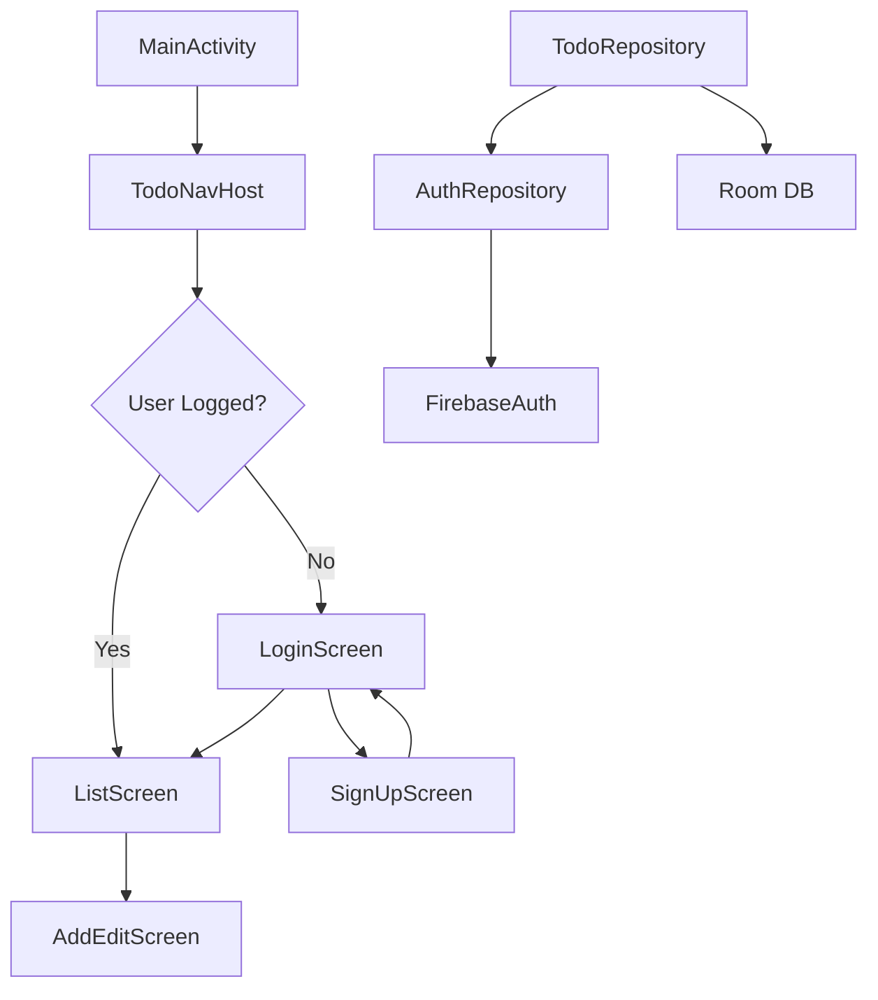

# Integração Firebase Authentication - ToDo App

## Contexto
O app atual é um ToDo List com Jetpack Compose, Room, Hilt e Navigation type-safe. Precisamos adicionar autenticação Firebase e persistência de tarefas por usuário.

**Prazo:** 09/02/2026 (2 dias)

---

## User Review Required

> [!IMPORTANT]
> Você precisa criar um projeto no **Firebase Console** e baixar o arquivo `google-services.json`. Sem isso, a autenticação não funcionará.

> [!WARNING]
> A integração vai modificar a estrutura do banco de dados. As tarefas existentes **não serão migradas** automaticamente para o novo formato com `userId`.

---

## Proposed Changes

### Firebase Configuration

#### [MODIFY] [build.gradle.kts](file:///c:/Users/gusfa/projetos-Gabriel/todoApp/build.gradle.kts)
- Adicionar plugin `com.google.gms.google-services`

#### [MODIFY] [settings.gradle.kts](file:///c:/Users/gusfa/projetos-Gabriel/todoApp/settings.gradle.kts)
- Adicionar repositório Google se necessário

#### [MODIFY] [libs.versions.toml](file:///c:/Users/gusfa/projetos-Gabriel/todoApp/gradle/libs.versions.toml)
- Adicionar versões: `firebase-bom`, `firebase-auth`, `googleServices`
- Adicionar libraries: `firebase-bom`, `firebase-auth-ktx`
- Adicionar plugin: `google-services`

#### [MODIFY] [app/build.gradle.kts](file:///c:/Users/gusfa/projetos-Gabriel/todoApp/app/build.gradle.kts)
- Adicionar plugin Google Services
- Adicionar dependências Firebase

#### [NEW] google-services.json
- **🔴 AÇÃO DO USUÁRIO:** Baixar do Firebase Console e colocar na pasta `app/`

---

### Authentication Layer

#### [NEW] [AuthRepository.kt](file:///c:/Users/gusfa/projetos-Gabriel/todoApp/app/src/main/java/com/example/todolist/data/auth/AuthRepository.kt)
```kotlin
interface AuthRepository {
    val currentUser: FirebaseUser?
    val isLoggedIn: Boolean
    suspend fun signIn(email: String, password: String): Result<FirebaseUser>
    suspend fun signUp(email: String, password: String): Result<FirebaseUser>
    fun signOut()
}
```

#### [NEW] [AuthRepositoryImpl.kt](file:///c:/Users/gusfa/projetos-Gabriel/todoApp/app/src/main/java/com/example/todolist/data/auth/AuthRepositoryImpl.kt)
- Implementação usando `FirebaseAuth.getInstance()`

---

### Login Screen

#### [NEW] [LoginScreen.kt](file:///c:/Users/gusfa/projetos-Gabriel/todoApp/app/src/main/java/com/example/todolist/ui/feature/login/LoginScreen.kt)
- Campos: Email, Password
- Botões: Login, "Ir para Sign Up"
- Estados: Loading, Error

#### [NEW] [LoginViewModel.kt](file:///c:/Users/gusfa/projetos-Gabriel/todoApp/app/src/main/java/com/example/todolist/ui/feature/login/LoginViewModel.kt)
- State: email, password, isLoading, error
- Events: EmailChanged, PasswordChanged, Submit

#### [NEW] [LoginEvent.kt](file:///c:/Users/gusfa/projetos-Gabriel/todoApp/app/src/main/java/com/example/todolist/ui/feature/login/LoginEvent.kt)

---

### SignUp Screen

#### [NEW] [SignUpScreen.kt](file:///c:/Users/gusfa/projetos-Gabriel/todoApp/app/src/main/java/com/example/todolist/ui/feature/signup/SignUpScreen.kt)
- Campos: Email, Password, Confirm Password
- Botão: Criar Conta
- Link: "Já tem conta? Login"

#### [NEW] [SignUpViewModel.kt](file:///c:/Users/gusfa/projetos-Gabriel/todoApp/app/src/main/java/com/example/todolist/ui/feature/signup/SignUpViewModel.kt)

#### [NEW] [SignUpEvent.kt](file:///c:/Users/gusfa/projetos-Gabriel/todoApp/app/src/main/java/com/example/todolist/ui/feature/signup/SignUpEvent.kt)

---

### Navigation

#### [MODIFY] [TodoNavHost.kt](file:///c:/Users/gusfa/projetos-Gabriel/todoApp/app/src/main/java/com/example/todolist/navigation/TodoNavHost.kt)
- Adicionar rotas: `LoginRoute`, `SignUpRoute`
- Mudar `startDestination` baseado no estado de autenticação
- Adicionar navegação entre Login ↔ SignUp → List

---

### Data Layer (Per-User Persistence)

#### [MODIFY] [TodoEntity.kt](file:///c:/Users/gusfa/projetos-Gabriel/todoApp/app/src/main/java/com/example/todolist/data/TodoEntity.kt)
- Adicionar campo `userId: String`

#### [MODIFY] [TodoDao.kt](file:///c:/Users/gusfa/projetos-Gabriel/todoApp/app/src/main/java/com/example/todolist/data/TodoDao.kt)
- Modificar queries para filtrar por `userId`

#### [MODIFY] [TodoRepositoryImpl.kt](file:///c:/Users/gusfa/projetos-Gabriel/todoApp/app/src/main/java/com/example/todolist/data/TodoRepositoryImpl.kt)
- Injetar `AuthRepository` para obter `userId`
- Passar `userId` nas operações

---

## Verification Plan

### Teste Manual (no Android Studio)

1. **Build e Run**
   ```bash
   ./gradlew assembleDebug
   ```
   Verificar se compila sem erros.

2. **Fluxo de Sign Up**
   - Abrir o app → deve mostrar tela de Login
   - Clicar em "Criar conta"
   - Preencher email/senha e confirmar
   - Deve redirecionar para lista de tarefas

3. **Fluxo de Login**
   - Fechar e reabrir o app
   - Fazer login com conta criada
   - Deve mostrar as tarefas do usuário

4. **Persistência por Usuário**
   - Criar tarefas com Usuário A
   - Logout → Login com Usuário B
   - Verificar que não vê as tarefas do Usuário A
   - Criar tarefas com Usuário B
   - Logout → Login com Usuário A
   - Verificar que só vê suas próprias tarefas

5. **Logout**
   - Verificar que logout redireciona para Login
   - Reabrir app → deve pedir login novamente

---

## Arquitetura Final



---

## Próximos Passos

1. ✅ Você aprovar este plano
2. Você criar o projeto no Firebase Console e baixar `google-services.json`
3. Eu implementar todas as mudanças
4. Você testar no emulador/dispositivo
